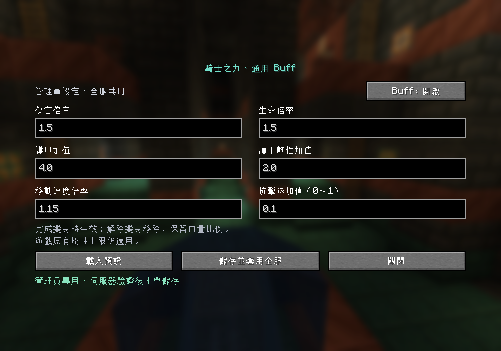

# KRC Rider Power

[繁體中文](README.zh-TW.md) · [Downloads](https://github.com/win10ogod/krc-rider-power/releases) · [MIT license](LICENSE)

One configurable, server-controlled **Rider Power** buff for completed [Kamen Rider Craft](https://www.curseforge.com/minecraft/mc-mods/kamen-rider-craft) transformations. Every eligible player shares the same bonuses; administrators can edit them in game.

The addon checks KRC's common driver and transformation interface. New forms using that interface can receive the same buff without adding rider names or form profiles.

## Installation

1. Use **Minecraft 1.21.1**, **Java 21**, and **NeoForge 21.1.244 or newer within the 21.1 series**.
2. Install Kamen Rider Craft and its GeckoLib and Player Animation Library dependencies.
3. Put the release JAR in `mods` on **both the client and server**.
4. Equip a complete KRC suit and finish transforming. Rider Power activates automatically and is removed when transformation eligibility ends.

The 1.0.0 release was tested with KRC **1.1.3**, NeoForge **21.1.244**, GeckoLib **4.9.2**, and Player Animation Library **1.1.6+mc.1.21.1**. Future compatibility builds identify their KRC version in the release title. The in-game editor and command messages currently use Traditional Chinese.

## Default bonuses

| Stat | Shared setting |
| --- | --- |
| Damage | ×1.5 |
| Maximum health | ×1.5 |
| Armor | +4 |
| Armor toughness | +2 |
| Movement speed | ×1.15 |
| Knockback resistance | +0.1 |

Damage is multiplied once, before armor and resistance calculations, for attacks attributed to the transformed player. This includes melee attacks, projectiles, and KRC skills carrying a player source. Self-damage and damage with no player source are excluded.

Attribute bonuses preserve modifiers from equipment and other mods. Minecraft's normal attribute limits still apply; the configuration itself is not silently reduced to those limits.

## Configuration

`config/krcboost.json` is created on first startup:

```json
{
  "enabled": true,
  "attackMultiplier": 1.5,
  "healthMultiplier": 1.5,
  "armorBonus": 4.0,
  "toughnessBonus": 2.0,
  "speedMultiplier": 1.15,
  "knockbackBonus": 0.1
}
```

| Command | Access | Action |
| --- | --- | --- |
| `/krcboost status` | Everyone | View shared settings and transformation eligibility |
| `/krcboost edit` | Operator level 2 | Edit values and apply them to the whole server |
| `/krcboost reload` | Operator level 2 or server console | Reload the JSON file |

Multipliers must be finite and at least 1; additive values must be finite and nonnegative. The knockback resistance bonus must be between 0 and 1. Set `enabled` to `false` to disable and remove the buff. Invalid files are not overwritten, and a failed reload retains the last valid configuration.

In the editor, **載入預設** loads defaults into the fields, **儲存並套用全服** saves and applies them, and **關閉** closes without saving. A stale editor cannot overwrite a newer administrator update.



## Consistent multiplayer bonuses

- Commands and save packets both require server-checked administrator permission.
- Eligibility comes from actual equipment and KRC transformation state. A belt alone, an incomplete suit, or an unfinished transformation does not qualify.
- Fixed modifier identifiers prevent stacking. An injected effect level is normalized or removed.
- Health percentage is preserved when maximum health changes: `8/20 → 12/30 → 8/20`. Repeated transformations do not refill health.
- Logout removes temporary modifiers before player data is saved; death and spectator mode remove the bonuses.
- Attacks and incoming damage recheck eligibility to avoid using stale transformation state.

These checks govern this addon's bonuses and editing permissions. Server operators remain responsible for other mods and server rules.

## Build and test

Install **JDK 21**, clone the repository, and run:

```bash
./gradlew test runGameTestServer build
```

On Windows, use `gradlew.bat test runGameTestServer build`. Gradle downloads the pinned KRC dependency from the author's Modrinth release; no local upstream JAR is required. The dependency is not bundled into this mod.

Builds are written to `build/libs/`. Install the regular JAR; `-sources.jar` is for source reference. The separate GameTest source set is excluded from release JARs. See [verification details](evidence/verification.md).

## Automatic KRC updates

[GitHub Actions](https://github.com/win10ogod/krc-rider-power/actions) builds and tests pushes and pull requests. The **Update KRC and build** workflow also checks every six hours for a new stable KRC release for Minecraft 1.21.1 and NeoForge. A successful build and complete test run update the pinned dependency on `main` and publish a downloadable compatibility prerelease. Failed candidates keep the existing dependency and release intact.

Use **Run workflow** to check immediately or rebuild the current dependency. See [automation details](docs/automatic-updates.md) for the tracked release source, failure handling, and schedule behavior.

## License and publishing

This addon's code and original assets are released under the [MIT license](LICENSE). Dependencies retain their own licenses. KRC Rider Power is an unofficial addon; thanks to the Kamen Rider Craft team for the base mod.

[CurseForge submission materials](publishing/curseforge-project.md) include an English description, project fields, an original icon, dependency links, and release notes.
